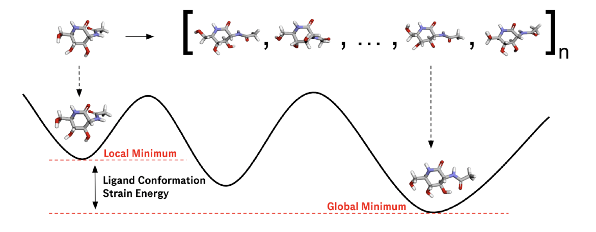

# StrainRelief 💊
StrainRelief calculates the ligand strain of docked poses and has a suite of different force fields with which to do this. This includes our own MACE neural network potential trained on SPICE2 and also Meta's FAIRChem models, such as e-SEN and UMA. Optimisations are run in parallel using the neural-optimiser package.

- 📄 The publication can be found [here](https://pubs.acs.org/doi/10.1021/acs.jcim.5c00586).
- 📊 All relevant datasets [here](https://huggingface.co/datasets/erwallace/LigBoundConf2.0).
- 💬 RAG [chatbot](https://strain-relief.streamlit.app/) for questions about the paper and references.
- 💻 Chatbot source [code](https://github.com/erwallace/paper_query).
- 📉 neural-optimiser [package](https://github.com/erwallace/neural-optimiser).


## Update 1.0.0

This update focuses on accelerating the StrainRelief backend and increasig usability through simpler configurations and workflows:

- Molecular optimisation are now paralellised using the `neural-optimiser` [package](https://github.com/erwallace/neural-optimiser) providing a 3x speed-up.
- Conformer generation is now orders-of-magnitude faster using Nvidia's nvMolKit [package](https://github.com/NVIDIA-Digital-Bio/nvMolKit).
- New simplified hyra configuration. An example of the full configuration is given [here](./examples/example_config.yaml).

**Note:** this introduces changes that are not backwards-compatible with previous versions.

## Installation
Pre-requisities: Python 3.11, PyTorch and PyTorch Geometric compatible with your envirnment

```bash
# For example
uv pip install torch==2.8.0 -f https://data.pyg.org/whl/torch-2.8.0+cu128.html
uv pip install torch-geometric==2.7.0 torch-cluster -f https://data.pyg.org/whl/torch-2.8.0+cu128.html
```

### Installation from PyPi

```
pip install strain-relief
```

### Installation from source (uv)
```bash
uv sync --extra dev --editable
```
or create a virtual environment and install the package and its dependencies in editable mode:
```bash
uv venv
source .venv/bin/activate
# [install torch and torch-geometric as above]
uv pip install -e ".[dev]"
uv pip install --force-reinstall e3nn==0.5 fairchem-core

uv run pre-commit install
```
**Note:** `mace-torch==0.3.x` requires `e3nn==0.4.4` (only for training, not inference). `fairchem-core` requires `e3nn>=0.5`. So until `mace-torch==0.4` is released we will have to do this finicky way of installing ([GitHub issue](https://github.com/ACEsuit/mace/issues/555)).

## The Protocol

The protocol used in StrainRelief is designed to be simple, fast and model agnostic - all that is needed to apply a new force field is to write a `neural-optimiser` `Calculator` class (such as an ASE calculator wrapper). Additionally, the package is already compatible with all MACE and Meta FAIRChem models.



The protocol consists of 5 steps:

1. Minimise the docked pose with a loose convergence criteria to give a local minimum.
2. Generate 20 conformers from the docked ligand pose.
3. Minimise the generated conformers (and the original docked pose) with a stricter convergence criteria.
4. Evaluate the energy of all conformers and choose the lowest energy as an approximation of the global minimum.
5. Calculate `E(ligand strain) = E(local minimum) - E(global minimum)` and apply threshold.

**N.B.** energies returned are in kcal/mol.

## Usage

StrainRelief runs are configured using hydra configs.

### Python Package

```
from strain_relief import compute_strain

computed = compute_strain(poses: list[RDKit.Mol], config: DictConfig)

for i, r in computed.iterrows():
    print(f"Pose {r['id']} has a strain of {r['ligand_strain']:.2f} kcal/mol")
```
For a complete set of examples see the tutorial [notebook](./examples/tutorial.ipynb).

### Command Line

```bash
strain-relief \
    experiment=mmff94 \
    io.input.parquet_path=data/example_ligboundconf_input.parquet \
    io.output.parquet_path=data/example_ligboundconf_output.parquet \
    conformers.numConfs=1 \
```

More examples are given [here](./examples/examples.sh), including the command used for the calculations in the StrainRelief paper.

### Adding Your Own Calculator

Add a new `Calculator` [class](https://github.com/erwallace/neural-optimiser/blob/main/src/neural_optimiser/calculators/base.py) from `neural-optimiser` to the `strain_relief/calculators/` directory. This can be as simple as implementing a wrapper around an existing ASE calculator:
```python
from neural_rotamers.calculators.base import Calculator

class YourCalculator(Calculator):

    def __init__(self, **kwargs):
        self.calculator = YourASECalculator(**kwargs)

    def _calculate(self, batch: Data | Batch) -> tuple[torch.Tensor, torch.Tensor]:
        """Return (energies, forces) from the calculator."""
        ase_atoms = batch.to_ase()
        ase_atoms.calc = self.calculator
        return ase_atoms.get_potential_energy(), ase_atoms.get_gradients()
```
**Note:** `MACECalculator` and `FAIRChemCalculator` from `neural-optimiser` use a `from_atomic_data` helper method. This converts `ConformerBatch` objects to `AtomicData` model inputs in a batched process; a workflow bottleneck not handled by either the MACE or FAIRChem internal ASE calculators. I would recommend implementing something similar for high throughput workflows.

Add a new config to `hydra_config/calculators/your_calculator.yaml`:

```
_target_: strain_relief.calculators.your_calculator.YourCalculator
model_paths: null
device: ${device}
any_other_kwargs: null
```

### Configurations

**Common kwargs**
- `threshold` (set by default to 16.1 kcal/mol - calibrated using [LigBoundConf 2.0](https://huggingface.co/datasets/erwallace/LigBoundConf2.0))
- `conformers.numConfs`
- `global_optimiser.steps`/`local_optimiser.steps`
- `global_optimiser.fmax`/`local_optimiser.fmax`
- `io.input.include_charged`
- `hydra.verbose`
- `seed`

### Logging

Logging is set to the `INFO` level by default which logs only aggregate information. `hydra.verbose=true` can be used to activate `DEBUG` level logging which includes information for every molecule and conformer.

## Unit Tests

- `uv run pytest tests/` - runs all tests (unit and integration)
- `uv run pytest tests/ -m "not integration"` - runs all unit tests

**Note:** Unit tests will run on a GPU if available.

## Citations
If you use StrainRelief or adapt the StrainRelief code for any purpose, please cite:

```bibtex
@article{wallace2025strain,
  title={Strain Problems Got You in a Twist? Try StrainRelief: A Quantum-Accurate Tool for Ligand Strain Calculations},
  author={Wallace, Ewan RS and Frey, Nathan C and Rackers, Joshua A},
  journal={Journal of Chemical Information and Modeling},
  year={2025},
  publisher={ACS Publications},
  url={https://pubs.acs.org/doi/10.1021/acs.jcim.5c00586}
}
```

## More information
For any questions, please reach out to [Ewan Wallace](https://www.linkedin.com/in/ewan-wallace-82297318a/): ewan.wallace@roche.com
